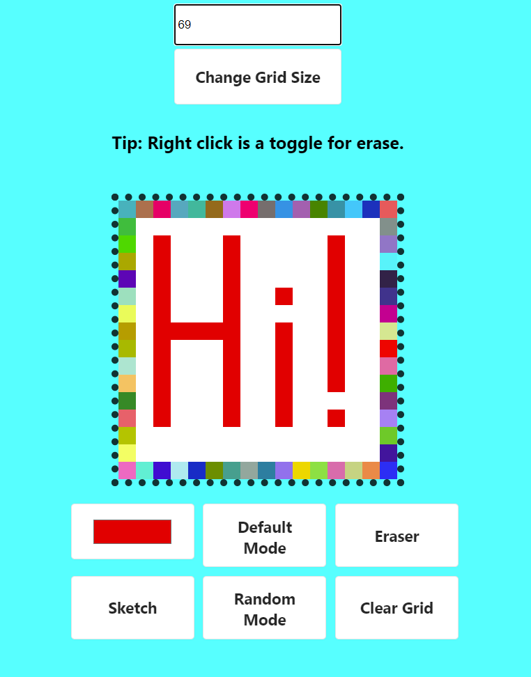

# Etch-A-Sketch
## Draw Something!

<table>
  <td align="center"><b>Made using:</b></td>
  <td> 
    
    
    
  </td>
</table>

## **Click on the picture/the link below to try!**

## [Click to open](https://redplusblue.github.io/etch-a-sketch/)

## Features: 
1. Board element changes colour whenever cursor hovers on it. 
2. Right click anywhere in the board to change to erase mode.
3. Can change color to any rgb color. 
4. Can Change mode to random mode in which each element of the board gets a random colour on hoveriung.
5. Can change size of the board

## What I used/learned: 
1. HTML
2. CSS Grid, Flexbox, inline block, @keyframes
3. JS Event listeners, dynamic node creation, function calls,

 

###### An exercise for [TheOdinProject](theodinproject.com)
